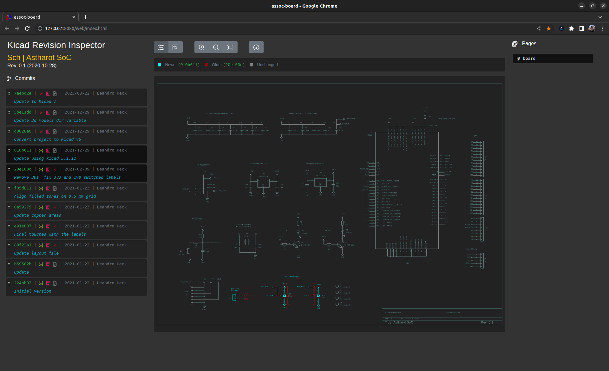
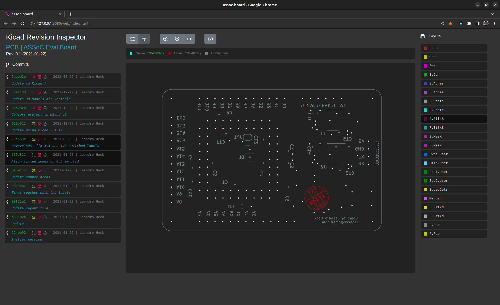
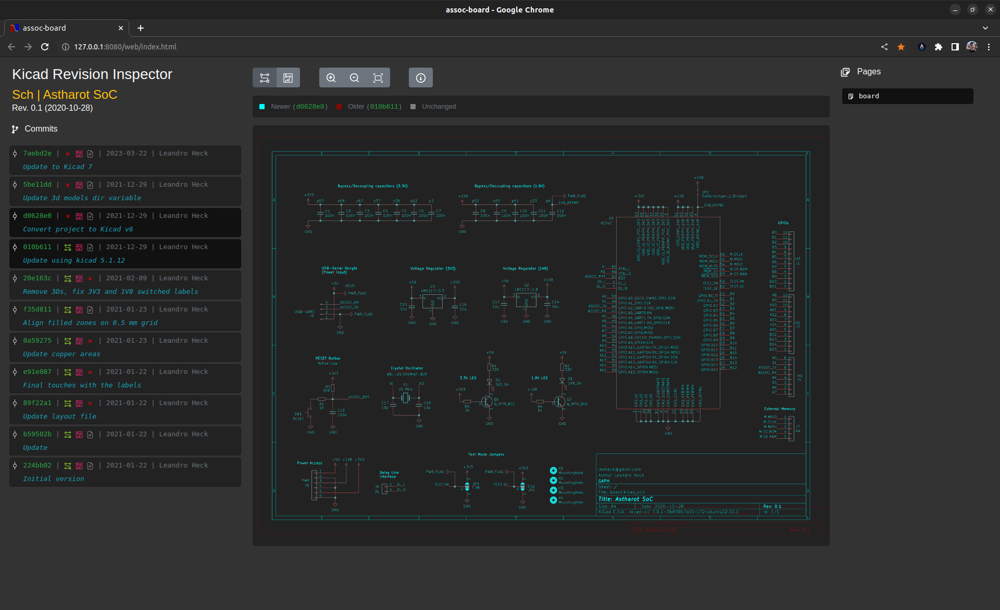
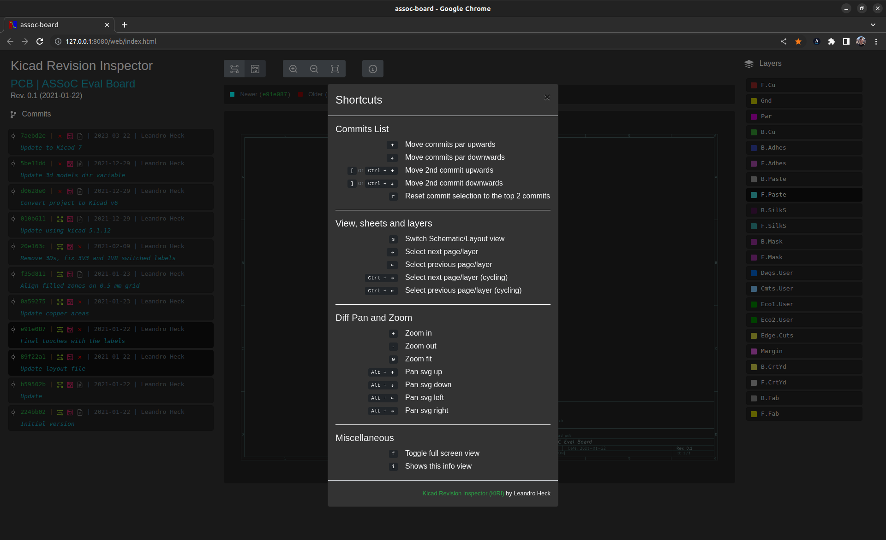

# Kicad Revision Inspector (KiRI)

KiRI started as a script to experiment having a visual diff tool for Kicad projects.
After some time, it became an interesting and it is still being updated.

Currently projects made with Kicad 5, 6 and 7 are supported.

KiRi uses internally existing tools to export schematics and layout to SVG images that can be later compared.

So, when exporting schematics pages to SVG images:

- if Kicad 7 is installed, the new `kicad-cli` is used for both projects made with Kicad 6 and 7
- if Kicad 6 is installed, schematics are exported using [xdotool](https://github.com/jordansissel/xdotool) on Linux/Windows and [cliclick](https://github.com/BlueM/cliclick) on macOS, using the GUI.
- if Kicad 5 is installed, [Plotgitsch](https://github.com/jnavila/plotkicadsch) and `plotgitsch` are used to export the schematics

When exporting the layout layers in SVG images:

- [Kicad-Diff](https://github.com/Gasman2014/KiCad-Diff) is used for all supported Kicad versions using `pcbnew` library available in python. `kicad-cli` is not used on Kicad 6 and 7 projects because it is slower than the python script since each layer has to be exported individually and this tool cannot do that at once.


## KiRI Installation

Check the Installation instructions, [here](INSTALL.md).


## Using KiRI

KiRI can be launched with the following command, anywhere, inside or outside of the repository of the project.

```bash
kiri [OPTIONS] [KICAD_PROJECT_FILE]
```

`KICAD_PROJECT_FILE` can be passed, but it can also be omitted. If running from inside the repo, it will use the `.pro` or `.kicad_pro` available. If both are present (which is not good), it will ask your choice. The same happens is running outside of the repository without passing the `KICAD_PROJECT_FILE`.


## Command line options (aka Help)

Command line flags can be seen using the `-h` flag
```bash
kiri -h
```

### Archiving generated files

There is a possibility to archive generated files (check the help above).

To visualize generated files it is not necessary to have kiri installed. You just have to unpack the generated package and then execute the webserver script (`./kiri-server`) inside of the folder, as shown below:

```bash
tar -xvzf kiri-2021.11.18-16h39.tgz
cd kiri
./kiri-server .
```

# Kicad Integration

It is possible to integrate KiRI with PCBNew by adding a button to its toolbar with the following command:

```bash
# Create folder if it does not exist
mkdir -p "~/.kicad/scripting/plugins"

# Copy the plugin there
cd ./kiri
cp -r "./kicad/plugin/kiri_v6/" "~/.kicad/scripting/plugins/kiri"
```

# KiRI Screenshots

Browsing the schematic view walking through and comparing each page of the schematics, individually.

<p align="center">
    
</p>

Browsing the layout view walking through and comparing each layer of the layout, individually.

<p align="center">
    
</p>

Here is the comparison of the schematics when the project is updated from using Kicad 5 (`.sch`) to Kicad 6 (`.kicad_sch`).

<p align="center">
    
</p>

Shortcuts are a really good way of walking through the commits, pages and layers quickly. Check the available shortcuts by hitting the shortcut `i`.

<p align="center">
    
</p>

A quick and old demo on the Youtube.

<p align="center">
<a href="https://youtu.be/zpssGsvCgi0" target="_blank">
    
</a>
</p>

---

<p align="center">
Are you enjoying using this tool, feel free to pay me a beer :). Cheers!
</p>

<p align="center">
    <a href="https://www.paypal.com/donate/?hosted_button_id=EPV73V7C5N4CJ"></a>
</p>
