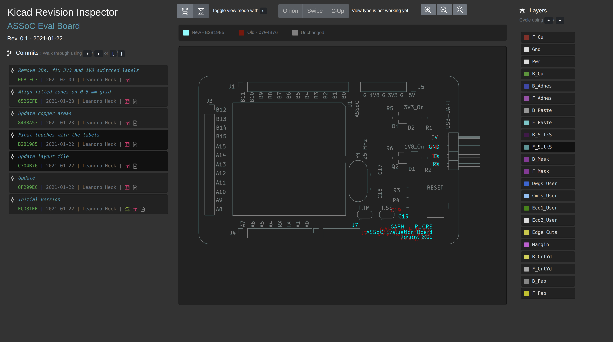

# Kicad Diff (kdiff)

This repo is a testcase to have a visual diff tool for Kicad.
It uses [Kicad-Diff](https://github.com/Gasman2014/KiCad-Diff) to generate layout diffs and [Plotgitsh](https://github.com/jnavila/plotkicadsch) to generate schematic diffs.

It is currently supporting Kicad projects that use GIT.

# Dependencies

> kdiff works with Kicad `5.*`


## Installing dependencies

To install dependencies with a single command, open a terminal (on Windows use WSL) and execute:

```bash 
sh -c "$(curl -fsSL https://raw.githubusercontent.com/leoheck/kdiff/main/install_dependencies.sh)"

```

## Installing dependencies on Windows
[Configure WSL](https://www.tenforums.com/tutorials/46769-enable-disable-windows-subsystem-linux-wsl-windows-10-a.html)

```batch
:: Enalbe Windows Sybsystem for Linux (using Power Shell)
dism.exe /online /enable-feature /featurename:Microsoft-Windows-Subsystem-Linux /all /norestart
Enable-WindowsOptionalFeature -Online -FeatureName Microsoft-Windows-Subsystem-Linux
#Install-WindowsFeature -Name Microsoft-Windows-Subsystem-Linux

:: Install Ubuntu 20.04
Invoke-WebRequest -Uri https://aka.ms/wsl-ubuntu-2004 -OutFile ~/Downloads/ubuntu-2004.zip
New-Item -Path C:\ubuntu-2004 -ItemType Directory
Expand-Archive -Path ~/Downloads/ubuntu-2004.zip C:\ubuntu-2004
Set-Location C:\ubuntu-2004
& .\ubuntu1804.exe
```

And then continue with the instructions in "Installing dependencies on Linux" inside the WSL (Ubuntu terminal).


## Linux/WSL dependencies

```bash
# Basic dependencies for Linux/WSL
sudo apt install -y libgmp-dev
sudo apt install -y pkg-config
sudo apt install -y opam
sudo apt install -y python3-pip
sudo apt install -y python3-tk
sudo apt install -y kicad
sudo apt install -y dos2unix
sudo apt install -y coreutils
sudo apt install -y zenity

# Initialize opam
opam init --disable-sandboxing --reinit
opam switch create 4.09.1
opam switch 4.09.1
eval $(opam env)

# Kicad-Diff dependencies
pip3 install pygubu
pip3 install python_dateutil
pip3 install tk
```

Zenity is optional. Windows users will need to have installed an X Server like [XMing](https://sourceforge.net/projects/xming/) to be able to run it with Zenity.

After installing dependencies continue with [Install 3rdParty Tools](https://github.com/leoheck/kdiff#install-3rdparty-tools)

## OSX dependencies

```bash
# Download and Install Kicad for OSX - https://www.kicad.org/download/macos/
sudo spctl --master-disable

# Opam dependencies
brew install gmp
brew install pkg-config
brew install opam

# Kdiff dependencies
brew install gsed
brew install findutils
brew install dos2unix
brew install coreutils

# Initialize opam
opam init --disable-sandboxing --reinit
opam switch create 4.09.1
opam switch 4.09.1
eval $(opam env)

# Plotgitsch dependencies
opam install lwt_ppx
opam install cmdliner
opam install base64
opam install sha
opam install tyxml
opam install git-unix

# Kicad-Diff dependencies
pip3 install pygubu
pip3 install python_dateutil
pip3 install tk
```

After installing dependencies continue with [Install 3rdParty Tools](https://github.com/leoheck/kdiff#install-3rdparty-tools)

## Installing and using

```bash
# Clone this project
git clone https://github.com/leoheck/kdiff
git submodule update --init --recursive

# Install custom plotgitsch
cd plotkicadsch
./install.sh

# Load KiCad-Diff environment
cd ../KiCad-Diff
source ./env.sh

# Load kdiff environment
cd ..
source ./env.sh
```

## Using
```
cd [kicad_git_repo]
kdiff board.pro
```

## Command line flags (Help)

How to access tool help, this may change, so prefer to use `kdiff -h` instead.

```
➜ kdiff -h

    USAGE :

        kdiff [OPTIONS] [KICAD_PROJECT]

    OPTIONS:

        -a|--all         Include all commits even if schematics/layout don't have changes
        -o|--older HASH  Show commits starting from this one
        -n|--newer HASH  Show commits until this one delimited by this one
        -r|--remove      Remove cache (kidiff) folder before run
        -l|--webservice  Do not launch webservice/browser at the end
        -p|--port PORT   Set webserver port
        -V|--verbose     Verbose
        -v|--version     Show version
        -D|--debug       Extra info
        -h|--help        This help

    KICAD_PROJECT:

        KICAD_PROJECT file (.pro) is optional.
        If it is missing then file selector in GUI is used instead

    EXAMPLES:

        # Launch GUI with file selector
        kdiff

        # Kicad project on the root of the repo
        kdiff board.pro

        # Nested project (with verbose and starting fresh)
        kdiff nested-project/board.pro -r -V
```

# Kicad integration

It is also possible to integrate kdiff in PCBNew toolbar

```bash
# Create folder if it does not exist
mkdir -p ~/.kicad/scripting/plugins

# Copy the pluging there
cd kdiff
cp -r kicad_plugin ~/.kicad/scripting/plugins/kdiff
```

## Examples

Schematic view, assets generated using Plotkicadsch

<p align="center">
	
</p>

Layout view, assets generated using Kicad-Diff

<p align="center">
	
</p>

Demo on Youtube

[](http://www.youtube.com/watch?v=PMC0USSsbDE "")
